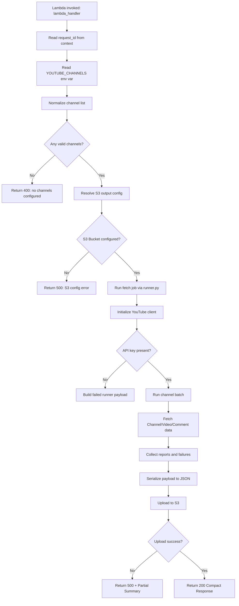

# YouTube Bot Analytics (Lambda Batch Fetch)

This branch is a Lambda-only batch fetch implementation for YouTube channel analytics.

The Lambda resolves configured channel inputs, fetches channel/video/comment data from the YouTube API, writes the full fetched JSON payload to S3, and returns a compact Lambda response with summary and upload metadata.

## What This Branch Does

- Runs through AWS Lambda handler `lambda_function.lambda_handler`.
- Accepts channel inputs from the `YOUTUBE_CHANNELS` environment variable.
- Fetches channel metadata, latest videos, top-level comments, and commenter channel enrichment.
- Writes the full runner payload to S3 as immutable UTF-8 JSON.
- Returns a compact response containing status, summary, failures, config, and S3 upload metadata.
- Emits INFO logs for Lambda flow, fetch progress, S3 upload, and response paths.

## Source Module Map

The code is organized around one Lambda fetch pipeline:

 Area | Files | Responsibility |
 --- | --- | --- |
 Lambda edge | `src/lambda_function.py` | Resolves channel inputs, validates S3 output config, runs the fetch job, and returns a compact response. |
 Runner | `src/runner.py` | Validates runtime options, configures logging, initializes the YouTube client, and builds the JSON-safe result payload. |
 Core | `src/core/` | Loads environment config, sets up logging, and wraps the YouTube API client. |
 Logic | `src/logic/` | Coordinates batch processing and builds channel/video reports. |
 Services | `src/services/` | Calls YouTube APIs (`youtube/`) and handles S3 uploads (`storage/s3.py`). |
 Domain | `src/domain/` | Defines report dataclasses (`models.py`) and status literals. |
 Utilities | `src/utils/` | Normalizes user input, environment lists, and API responses. |

## Configuration

Lambda environment variables used by this fetch job:

 Variable | Required | Default | Description |
 --- | --- | --- | --- |
 `YOUTUBE_API_KEY` | Yes | None | YouTube Data API key. |
 `FETCH_OUTPUT_S3_BUCKET` | Yes | None | S3 bucket for the JSON payload. |
 `YOUTUBE_CHANNELS` | Yes | None | Comma-separated channel handles, IDs, or URLs. |
 `FETCH_OUTPUT_S3_PREFIX` | No | `fetch_runs` | S3 key prefix. |
 `YOUTUBE_REQUEST_DELAY_MS` | No | `150` | Delay in ms between API requests. |
 `YOUTUBE_VIDEO_WORKERS` | No | `1` | Concurrent video processing workers per channel. |

Example:
```bash
export YOUTUBE_API_KEY="your_api_key_here"
export YOUTUBE_CHANNELS="@HombaleFilms,@MrBeast,UCX6OQ3DkcsbYNE6H8uQQuVA"
export FETCH_OUTPUT_S3_BUCKET="your-output-bucket"
```

## Complete Runtime Flow



## Deployment Notes

1.  **Dependencies**: Listed in `requirements.txt`.
2.  **Handler**: Set to `lambda_function.lambda_handler`.
3.  **Permissions**: Lambda role must have `s3:PutObject` for the target bucket.
4.  **Layer Construction**:
    ```bash
    mkdir -p python
    pip install -r requirements.txt -t python/
    zip -r layer.zip python
    ```

## Companion Mongo Ingest Lambda

The fetch Lambda is designed to trigger a companion ingest Lambda (in a separate branch/repository) via S3 `ObjectCreated` events. The fetcher remains focused on data retrieval and immutable storage, while the ingestor handles database synchronization.
