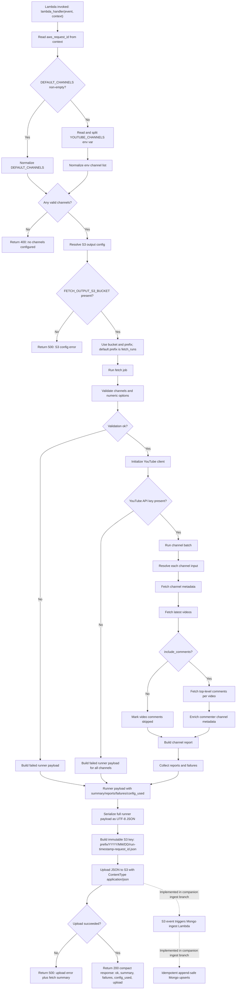

# YouTube Bot Analytics (Lambda Batch Fetch)

This branch is a Lambda-only batch fetch implementation for YouTube channel analytics.

The Lambda resolves configured channel inputs, fetches channel/video/comment data from the YouTube API, writes the full fetched JSON payload to S3, and returns a compact Lambda response with summary and upload metadata.

## What This Branch Does

- Runs through AWS Lambda handler `lambda_function.lambda_handler`.
- Accepts channel inputs from `DEFAULT_CHANNELS` in code or the `YOUTUBE_CHANNELS` environment variable.
- Fetches channel metadata, latest videos, top-level comments, and commenter channel enrichment.
- Writes the full runner payload to S3 as immutable UTF-8 JSON.
- Returns a compact response containing status, summary, failures, config, and S3 upload metadata.
- Emits INFO logs for Lambda flow, fetch progress, S3 upload, and response paths.

## What Was Removed

Legacy CLI/API/video-mode workflows were intentionally removed in this branch.

Removed legacy surfaces:
- `src/main.py`
- `src/api/`
- `src/cli/`
- legacy `src/export/` CLI/file export workflows
- `src/credentials/`

Current `src/export/` only contains minimal S3 fetch-output persistence helpers.

## Complete Runtime Flow



## Lambda Entrypoint

File: `src/lambda_function.py`

Deployment handler:

```text
lambda_function.lambda_handler
```

Import path:

```python
from lambda_function import lambda_handler
```

Runtime notes:
- Function signature remains `lambda_handler(event, context)` for AWS compatibility.
- `event` is currently unused.
- `context.aws_request_id` is used in the S3 object key when available.
- Channel resolution happens before S3 config resolution.
- Current handler call uses `run_fetch_job(channels, max_videos=20, max_comments=2000, quiet=False)`.

## Configuration

Required Lambda environment variables:

| Variable | Required | Description |
| --- | --- | --- |
| `YOUTUBE_API_KEY` | Yes | YouTube Data API key used by the fetch job. |
| `FETCH_OUTPUT_S3_BUCKET` | Yes | S3 bucket where the full fetched JSON payload is written. |
| `YOUTUBE_CHANNELS` | Yes, when `DEFAULT_CHANNELS` is empty | Comma-separated channel inputs such as handles, channel IDs, names, or supported YouTube URLs. |

Optional Lambda environment variables:

| Variable | Default | Description |
| --- | --- | --- |
| `FETCH_OUTPUT_S3_PREFIX` | `fetch_runs` | S3 key prefix used before the timestamped object path. |
| `YOUTUBE_REQUEST_DELAY_MS` | `150` | Delay in milliseconds between YouTube API requests when no explicit runner delay is provided. |

Example:

```bash
export YOUTUBE_API_KEY="your_api_key_here"
export YOUTUBE_CHANNELS="@HombaleFilms,@MrBeast,UCX6OQ3DkcsbYNE6H8uQQuVA"
export FETCH_OUTPUT_S3_BUCKET="your-output-bucket"
export FETCH_OUTPUT_S3_PREFIX="fetch_runs"
```

Channel input precedence:
1. `DEFAULT_CHANNELS` in `src/lambda_function.py` when non-empty.
2. Otherwise `YOUTUBE_CHANNELS` from the Lambda environment.

If no valid channels are resolved, Lambda returns `400` and does not run the fetch job.

## S3 Output Contract

The Lambda uploads the full runner payload to S3 after each fetch job, including partial-failure results.

Object key format:

```text
<prefix>/YYYY/MM/DD/run-YYYYMMDDTHHMMSSZ-<aws_request_id-or-local-uuid>.json
```

Default prefix example:

```text
fetch_runs/2026/06/01/run-20260601T123456Z-abc123.json
```

Upload details:
- JSON is serialized with `ensure_ascii=False` and encoded as UTF-8.
- S3 `ContentType` is `application/json`.
- The Lambda execution role must allow `s3:PutObject` for the configured bucket/prefix.
- Upload metadata returned by Lambda includes `bucket`, `key`, `s3_uri`, `size_bytes`, and optional `etag`.

Saved S3 JSON shape is the full runner payload:

```json
{
  "ok": true,
  "summary": {"total": 2, "success": 2, "failed": 0},
  "reports": [],
  "failures": [],
  "config_used": {
    "include_comments": true,
    "max_videos": 20,
    "max_comments": 2000,
    "delay_ms": 150,
    "quiet": false
  }
}
```

## Runner API

Programmatic runner:

```python
from lambda_runner import run_fetch_job

result = run_fetch_job(
    channels=["@HombaleFilms", "https://www.youtube.com/@MrBeast"],
    include_comments=True,
    max_videos=10,
    max_comments=1000,
    delay_ms=None,
    quiet=False,
)
```

Runner parameters:
- `channels`: list of channel IDs, handles, names, or supported YouTube URLs.
- `include_comments`: when false, videos are included and comments are marked skipped.
- `max_videos`: latest videos to fetch per channel.
- `max_comments`: top-level comments to fetch per video.
- `delay_ms`: override request delay; when `None`, uses `YOUTUBE_REQUEST_DELAY_MS` or default `150`.
- `quiet`: when true, suppresses INFO logs through logging configuration.

Runner return payload:
- `ok`: true when all channel inputs succeeded.
- `summary`: total/success/failed counts.
- `reports`: full channel reports with videos and comments.
- `failures`: list of `{channel_input, error}` items.
- `config_used`: resolved runtime config.
- `error`: present for top-level validation/API-key initialization failures.

## Lambda Response Contract

`lambda_handler` always returns an API Gateway-style envelope:

```json
{
  "statusCode": 200,
  "headers": {"Content-Type": "application/json"},
  "body": "{...json string...}"
}
```

Success or partial fetch failure response body:

```json
{
  "ok": true,
  "summary": {"total": 2, "success": 2, "failed": 0},
  "failures": [],
  "config_used": {
    "include_comments": true,
    "max_videos": 20,
    "max_comments": 2000,
    "delay_ms": 150,
    "quiet": false
  },
  "upload": {
    "bucket": "your-output-bucket",
    "key": "fetch_runs/2026/06/01/run-20260601T123456Z-abc123.json",
    "s3_uri": "s3://your-output-bucket/fetch_runs/2026/06/01/run-20260601T123456Z-abc123.json",
    "size_bytes": 12345,
    "etag": "\"...\""
  }
}
```

Important response behavior:
- Full `reports` are not returned by Lambda to avoid large responses.
- Full `reports` are saved in the S3 JSON object.
- Partial channel failures still upload to S3 and return `200`; `ok` may be `false`.
- Missing channels returns `400`.
- Missing S3 bucket config returns `500`.
- S3 upload failure returns `500` with fetch summary, failures, config, and `upload: null`.

Missing channels example body:

```json
{
  "ok": false,
  "error": "No channels configured. Set DEFAULT_CHANNELS in code or YOUTUBE_CHANNELS env var."
}
```

S3 upload failure example body:

```json
{
  "ok": false,
  "error": "Failed to upload fetch output to S3: ...",
  "summary": {"total": 2, "success": 2, "failed": 0},
  "failures": [],
  "config_used": {},
  "upload": null
}
```

## Logging

INFO logging is enabled by the current Lambda handler because it calls `run_fetch_job(..., quiet=False)`.

Logs include:
- Lambda invocation start and request id.
- Channel source and resolved channel count.
- S3 bucket/prefix destination.
- Fetch job validation and runtime config.
- YouTube client initialization success/failure.
- Batch/channel/video/comment progress from service layers.
- S3 key generation, upload destination, upload size, and S3 URI.
- Final Lambda response path and summary.

Logs intentionally do not include:
- `YOUTUBE_API_KEY` value.
- Full fetched JSON body.
- Comment text payloads.
- S3 object body content.

## Deployment Notes

Dependencies are listed in `requirements.txt`:
- `google-api-python-client`
- `google-auth-httplib2`
- `boto3`

Build a Lambda dependency layer using the required Conda environment:

```bash
mkdir -p python
conda run -n protoenv pip install -r requirements.txt -t python/
zip -r layer.zip python
```

Deploy notes:
- Publish `layer.zip` as a Lambda layer and attach it to the function.
- Package app source separately and include `src/` in the function artifact.
- Set the Lambda handler to `lambda_function.lambda_handler`.
- Configure environment variables in Lambda, not in source code.
- Grant the Lambda role `s3:PutObject` for the configured output bucket/prefix.
- Keep `YOUTUBE_API_KEY` secret and avoid logging it.

## Companion Mongo Ingest Lambda

Mongo ingest is implemented separately in the companion branch `lambda/youtube-bot-analytics-ingest-s3`.

That branch contains the S3-to-Mongo Lambda only. It does not call YouTube and does not include the fetch Lambda code.

Current fetch Lambda responsibility:
- Fetch YouTube analytics data.
- Write immutable JSON objects to S3.
- Return compact status and S3 location.

Companion ingest Lambda responsibility:
- Trigger from S3 object-created events.
- Read the saved fetch JSON.
- Perform append-safe, idempotent MongoDB upserts.

Companion ingest branch source layout:
- `src/ingest_s3/config.py`: Mongo environment variable loading.
- `src/ingest_s3/event_parser.py`: S3 event parsing.
- `src/ingest_s3/payload_schema.py`: fetch payload validation.
- `src/ingest_s3/transformer.py`: channel/video/comment document transformation.
- `src/ingest_s3/mongo_writer.py`: Mongo bulk upsert writer.

Companion ingest required environment variables:
- `MONGO_URI`
- `MONGO_DB_NAME`
- `MONGO_CHANNELS_COLLECTION`
- `MONGO_VIDEOS_COLLECTION`
- `MONGO_COMMENTS_COLLECTION`
