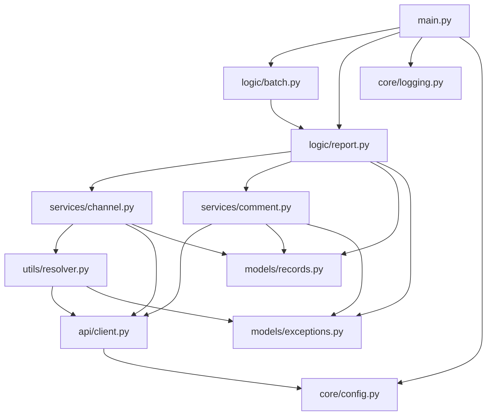
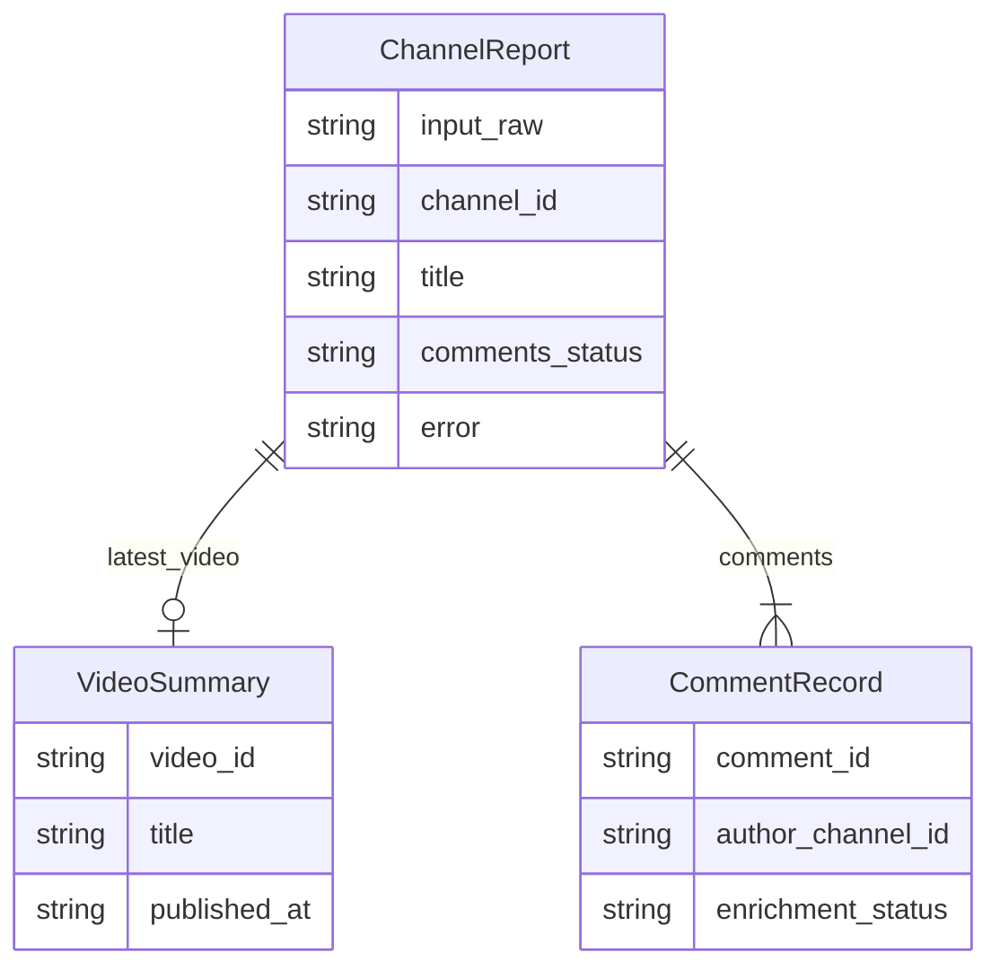

# YouTube Bot Analytics

A powerful CLI tool to identify potential bot activity on YouTube. By analyzing channel metadata, latest video comments, and enriching commenter profiles, this tool helps you spot patterns typical of automated accounts.

## Features

- **Channel Resolution**: Automatically handles @handles, URLs, and channel IDs.
- **Metadata Extraction**: Fetches subscriber counts, video counts, and account creation dates.
- **Comment Analysis**: Pulls top-level comments from the latest video.
- **Profile Enrichment**: Fetches channel data for every commenter to identify throwaway accounts.
- **Batch Processing**: Analyze multiple channels from a CSV or text file.
- **Flexible Export**: Save results in JSON, CSV, or both.

## Getting Started

### Prerequisites

- Python 3.10 or higher
- A [YouTube Data API v3 key](https://console.cloud.google.com/apis/library/youtube.googleapis.com)

### Installation

1. **Clone the repository**:
   ```bash
   git clone https://github.com/your-repo/youtube-bot-analytics.git
   cd youtube-bot-analytics
   ```

2. **Create a virtual environment**:
   ```bash
   python3 -m venv venv
   source venv/bin/activate  # On Windows: venv\Scripts\activate
   ```

3. **Install dependencies**:
   ```bash
   pip install -r requirements.txt
   ```

### Configuration

1. **Set up credentials**:
   ```bash
   mkdir -p src/credentials
   cp src/credentials/.env.example src/credentials/.env
   ```

2. **Add your API key**:
   Open `src/credentials/.env` and add your YouTube API key:
   ```ini
   YOUTUBE_API_KEY=your_actual_api_key_here
   ```

## Usage

The tool operates in two primary modes: **Single Channel** and **Batch Mode**.

### Single Channel Mode

Provide a single identifier (URL, @handle, or ID) using the `--channel` flag:

```bash
# Using @handle
python src/main.py --channel @MrBeast

# Using full URL
python src/main.py --channel https://www.youtube.com/@MrBeast

# Using canonical Channel ID
python src/main.py --channel UCX6OQ3DkcsbYNE6H8uQQuVA
```

### Batch Mode

Process multiple channels by providing a file path with the `--batch` flag:

```bash
python src/main.py --batch channels.txt
```

#### Supported File Formats

- **Plain Text (`.txt`)**: One identifier per line. Lines starting with `#` are ignored.
  ```text
  @MrBeast
  https://www.youtube.com/@PewDiePie
  # This is a comment
  UCX6OQ3DkcsbYNE6H8uQQuVA
  ```

- **CSV (`.csv`)**: Must contain a header row. The tool looks for columns named `channel`, `url`, `handle`, `channel_url`, or `channel_id`.
  ```csv
  channel
  @MrBeast
  @PewDiePie
  ```

### CLI Options Reference

| Option | Default | Description |
|:-------|:--------|:------------|
| `--channel ID` | - | Single channel identifier (URL, @handle, or ID). |
| `--batch FILE` | - | Path to a `.txt` or `.csv` file for batch processing. |
| `--output-dir PATH`| `output/<timestamp>/` | Directory where results will be saved. |
| `--format FMT` | `both` | Output format: `json`, `csv`, or `both`. |
| `--max-comments N` | `100` | Max top-level comments to fetch (API limit is 100). |
| `--no-comments` | `False` | Skip comment fetching and profile enrichment. |
| `--delay-ms N` | `150` | Milliseconds to wait between API calls. |
| `--quiet` | `False` | Suppress all logs except errors. |
| `--debug` | `False` | Enable detailed debug logging (includes API timing). |

### Logging

Flow logs are written to `stderr` by default, while the summary report is printed to `stdout`.

```bash
# Standard run (INFO logs on stderr, summary on stdout)
python src/main.py --channel @MrBeast

# Quiet mode (only errors)
python src/main.py --channel @MrBeast --quiet

# Debug mode (detailed API telemetry)
python src/main.py --channel @MrBeast --debug
```

## Understanding Output

Results are stored in timestamped directories within the `output/` folder by default.

### Directory Structure

```text
output/
└── 2026-05-24_153045/         # Run timestamp
    ├── channel_report.json    # Full data (Single mode) or reports.json (Batch)
    └── comments.csv           # Flat list (Single mode) or all_comments.csv (Batch)
```

### Status Definitions

The tool uses status fields to explain why data might be missing:

| Field | Status | Meaning |
|:------|:-------|:--------|
| **`comments_status`** | `ok` | Comments were successfully fetched. |
| | `none` | No comments were found on the video. |
| | `disabled` | Comments are disabled for this video. |
| | `skipped` | Comment fetching was skipped via `--no-comments`. |
| | `no_video` | No videos were found for this channel. |
| **`enrichment_status`**| `ok` | Commenter's channel metadata was successfully loaded. |
| | `no_channel` | Commenter has no linked YouTube channel. |
| | `not_found` | Commenter's channel exists but returned no metadata. |
| | `pending` | Enrichment step has not yet run for this record. |

### Bot-Detection Signals (Manual Review)

While this tool doesn't automatically flag bots, you can use these signals in the exported CSV to prioritize your review:

1. **`no_channel` Status**: Accounts without a linked channel are often used for bulk spam.
2. **New Accounts**: Compare `author_channel_created_at` with `comment_published_at`. Accounts created just hours or days before commenting are suspicious.
3. **Missing Metadata**: `enrichment_status = not_found` often indicates accounts that were deleted or hidden shortly after commenting.
4. **Pattern Analysis**: Look for identical comment text from different authors in the `comment_text` column.

## Developer Guide

### Architecture & Design

#### System Flow


#### Layered Architecture

The codebase follows a strict downward dependency flow.



### Data Model



### API Quota Usage

Each channel lookup consumes approximately:

- **1 unit**: Resolve channel ID (skipped if input is already `UC...`)
- **1 unit**: Fetch channel metadata
- **1 unit**: Identify latest video
- **1 unit**: Fetch comments (per 100 comments)
- **1 unit**: Enrich commenter profiles (per 50 commenters)

With the default free quota of 10,000 units/day, you can process ~50–100 channels daily.

### Project Layout

```text
src/
├── main.py                 # CLI entry point
├── api/                    # YouTube client
├── core/                   # Logging, Config
├── credentials/            # .env storage
├── export/                 # Output writers
├── logic/                  # Orchestration
├── models/                 # Data classes & Exceptions
├── services/               # Domain logic
└── utils/                  # Helper utilities
```
