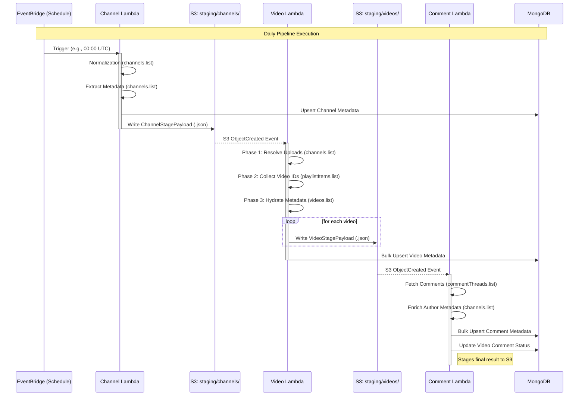
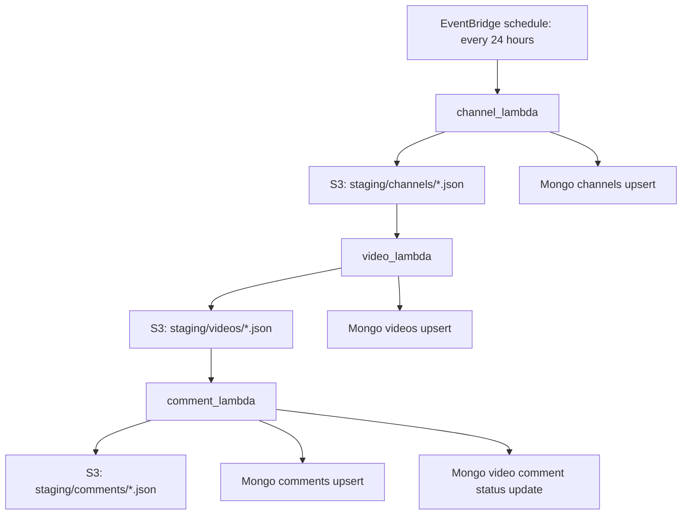
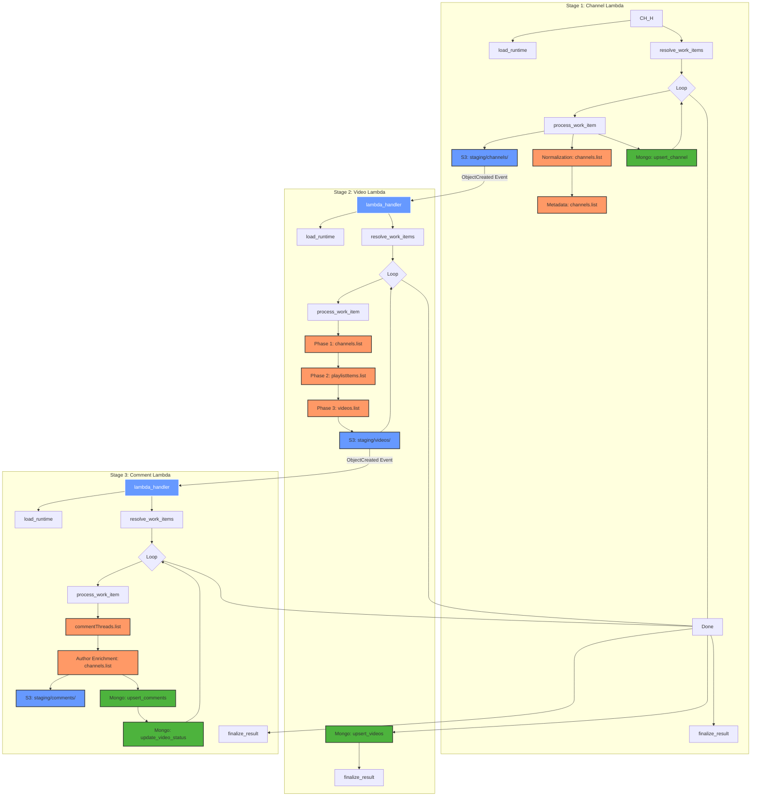

# YouTube Bot Analytics Staged Lambda Pipeline

This branch splits the previous bundled fetch job into three independent AWS
Lambda folders. Each Lambda has a root handler, a task-based `runner.py`, and a
local support package. The runner owns payload formation, YouTube API work, S3
staging writes, and Mongo document shaping.

There is no shared package on purpose. Duplication keeps each Lambda easy to
read and easy to package as a standalone function.

## Runtime Flow





The S3 staging objects are the durable handoff between Lambdas. The pipeline
uses one JSON object per unit of work so S3 triggers can fan out into short,
retryable invocations.

## Folder Map

| Folder | Handler | Trigger | Responsibility |
| --- | --- | --- | --- |
| `channel_lambda/` | `lambda_function.lambda_handler` | EventBridge schedule | `lambda_function.py` calls task functions in `runner.py`; `channel_job/` contains local config, models, S3, Mongo, YouTube, logging, and utility modules. |
| `video_lambda/` | `lambda_function.lambda_handler` | S3 `ObjectCreated` on `staging/channels/` | `lambda_function.py` calls task functions in `runner.py`; `video_job/` contains local config, models, S3, Mongo, YouTube, logging, and utility modules. |
| `comment_lambda/` | `lambda_function.lambda_handler` | S3 `ObjectCreated` on `staging/videos/` | `lambda_function.py` calls task functions in `runner.py`; `comment_job/` contains local config, models, S3, Mongo, YouTube, logging, and utility modules. |

Each local job package contains:

```text
client/
config/
model/
utils/
```

## S3 Prefixes

| Prefix | Key format | Written by | Read by | Contents |
| --- | --- | --- | --- | --- |
| `staging/channels/` | `<channel_id>-<job_id>.json` | `channel_lambda` | `video_lambda` | One resolved channel payload per object. |
| `staging/videos/` | `<video_id>-<job_id>.json` | `video_lambda` | `comment_lambda` | One video payload per object. |
| `staging/comments/` | `<video_id>-<job_id>.json` | `comment_lambda` | Analytics/debug consumers | Final per-video comment result payload. |

## Payload Schema

The pipeline uses a versioned JSON schema for S3 objects. The current version is `2026-06-02`. Every staged object includes a `schema_version` field to allow consumers to handle evolution.

Every staged object includes `created_at` and `expires_at` in the JSON body.
The default logical TTL is two days. Configure the S3 bucket lifecycle with an
expiration rule of `Days=2` for the `staging/` prefix to remove old staging
objects automatically.

## Environment Variables

### `channel_lambda`

| Env name | Required | Default | Description |
| --- | --- | --- | --- |
| `YOUTUBE_API_KEY` | Yes | None | YouTube Data API key. |
| `YOUTUBE_CHANNELS` | No | `CODE_CHANNELS` in `channel_lambda/channel_job/config/settings.py` | Comma-separated channel handles, channel IDs, names, or YouTube channel URLs. When set, this env var is used instead of `CODE_CHANNELS`. |
| `PIPELINE_S3_BUCKET` | Yes | None | Bucket used for channel-stage objects. |
| `CHANNEL_STAGE_PREFIX` | No | `staging/channels` | Prefix for channel-stage objects written by `channel_lambda`. |
| `STAGING_TTL_DAYS` | No | `2` | Logical TTL added to staged payloads and S3 metadata. |
| `YOUTUBE_REQUEST_DELAY_MS` | No | `150` | Delay after each YouTube API call. |
| `LOG_LEVEL` | No | `INFO` | Logging level. Supports standard Python levels such as `DEBUG`, `INFO`, `WARNING`, and `ERROR`. |
| `MONGO_URI` | Yes | None | MongoDB connection string. |
| `MONGO_DB_NAME` | No | `youtube_bot_analytics` | Mongo database name. |
| `MONGO_CHANNELS_COLLECTION` | No | `channels` | Collection for channel documents. |

Leave `CODE_CHANNELS` empty when the channel list should come only from Lambda
environment variables.

### `video_lambda`

| Env name | Required | Default | Description |
| --- | --- | --- | --- |
| `YOUTUBE_API_KEY` | Yes | None | YouTube Data API key. |
| `PIPELINE_S3_BUCKET` | Yes | None | Bucket used to read channel-stage objects and write video-stage objects. |
| `VIDEO_STAGE_PREFIX` | No | `staging/videos` | Prefix for video-stage objects written by `video_lambda`. |
| `STAGING_TTL_DAYS` | No | `2` | Logical TTL added to staged payloads and S3 metadata. |
| `YOUTUBE_MAX_VIDEOS` | No | `20` | Max latest videos fetched per channel. |
| `YOUTUBE_REQUEST_DELAY_MS` | No | `150` | Delay after each YouTube API call. |
| `LOG_LEVEL` | No | `INFO` | Logging level. Supports standard Python levels such as `DEBUG`, `INFO`, `WARNING`, and `ERROR`. |
| `MONGO_URI` | Yes | None | MongoDB connection string. |
| `MONGO_DB_NAME` | No | `youtube_bot_analytics` | Mongo database name. |
| `MONGO_VIDEOS_COLLECTION` | No | `videos` | Collection for video documents. |

### `comment_lambda`

| Env name | Required | Default | Description |
| --- | --- | --- | --- |
| `YOUTUBE_API_KEY` | Yes | None | YouTube Data API key. |
| `PIPELINE_S3_BUCKET` | Yes | None | Bucket used to read video-stage objects and write comment-stage objects. |
| `COMMENT_STAGE_PREFIX` | No | `staging/comments` | Prefix for comment-stage objects written by `comment_lambda`. |
| `STAGING_TTL_DAYS` | No | `2` | Logical TTL added to staged payloads and S3 metadata. |
| `YOUTUBE_MAX_COMMENTS` | No | `2000` | Max top-level comments fetched per video. |
| `YOUTUBE_REQUEST_DELAY_MS` | No | `150` | Delay after each YouTube API call. |
| `LOG_LEVEL` | No | `INFO` | Logging level. Supports standard Python levels such as `DEBUG`, `INFO`, `WARNING`, and `ERROR`. |
| `MONGO_URI` | Yes | None | MongoDB connection string. |
| `MONGO_DB_NAME` | No | `youtube_bot_analytics` | Mongo database name. |
| `MONGO_VIDEOS_COLLECTION` | No | `videos` | Collection for video documents. |
| `MONGO_COMMENTS_COLLECTION` | No | `comments` | Collection for comment documents. |

## Mongo Write Strategy

Writes are idempotent upserts:

| Collection | Upsert key |
| --- | --- |
| Channels | `channel_id` |
| Videos | `video_id` |
| Comments | `comment_id` |

The stage always writes S3 before Mongo. If Mongo fails, the S3 object remains
available for replay/debugging.

### Mongo Timestamp Enrichment

The pipeline uses a `dump_model` helper that automatically enriches MongoDB
documents with native BSON datetime objects. Any field ending in `_at` that
contains an ISO-8601 string (e.g., `created_at`) is copied to a new field with
the `__d` suffix (e.g., `created_at__d`) during the write.

This allows for efficient date-range queries in MongoDB while preserving the
original string format in the JSON payload and S3 objects.

### Pipeline Function Execution Flow

The following vertical flowchart details the execution sequence of functions across all three Lambda jobs, illustrating how they interact with external services and each other over time.



### Legend
| Color | Client / Service |
| :--- | :--- |
| 🟠 | **YouTube Data API** (Data retrieval) |
| 🔵 | **Amazon S3** (Staging & Event Triggers) |
| 🟢 | **MongoDB** (Final Metadata Persistence) |

## Lambda Comparison & Processing Strategies

The `video_lambda` occupies a unique structural and operational position in the pipeline compared to the `channel_lambda` (entry point) and `comment_lambda` (terminal stage). While all three share common infrastructure, their internal mechanics differ significantly.

### 1. Architectural Role: The "Fan-Out" Engine
The most fundamental difference is the **cardinality of output**.
*   **Channel Lambda (1:1):** Takes one input (a channel handle/ID) and produces one output (one S3 object and one Mongo record).
*   **Video Lambda (1:N):** This is the pipeline's primary expansion point. A single trigger (one channel) generates multiple individual S3 objects (one per video). This "fans out" the work, allowing many `comment_lambda` instances to run in parallel.
*   **Comment Lambda (1:1 Summary):** Although it fetches many comments, it processes them for a single video and outputs a single summary S3 object for that video.

### 2. Processing Strategy: "Stage Early, Persist Late"
The `video_lambda` is the only function that intentionally separates its S3 staging from its MongoDB persistence for performance and reactivity.
*   **Immediate Staging:** Inside its video loop, it uploads each video to S3 immediately. This ensures that the downstream `comment_lambda` can start working as soon as the first video is found.
*   **Deferred Batching:** It collects all video metadata in memory and performs a **single bulk MongoDB upsert** only after the loop finishes.
*   **Comparison:** 
    *   `channel_lambda` does both S3 and Mongo writes inside its loop for every channel.
    *   `comment_lambda` does both writes inside its loop for every video.

### 3. YouTube API Complexity: Three-Phase Resolution
The `video_lambda` has the most complex interaction with the YouTube API to ensure data accuracy:
1.  **Playlist Resolution:** It first resolves the channel's "Uploads" playlist ID.
2.  **ID Collection:** It iterates through the playlist to gather video IDs.
3.  **Snippet Hydration:** It performs a secondary "Videos" API call to hydrate those IDs into full metadata documents.
*   **Comparison:** `channel_lambda` and `comment_lambda` typically use more direct single-type API calls (though `comment_lambda` does secondary enrichment for comment authors).

### 4. Data Flow & Context Passing
The `video_lambda` acts as a crucial context carrier.
*   **Downstream Enrichment:** It takes metadata from the `channel_lambda` (like the channel title and ID) and merges it into the `VideoStagePayload`.
*   **Self-Containment:** This allows the `comment_lambda` to know which channel a video belongs to without having to query MongoDB or the YouTube API again, reducing API quota usage.

### 5. Summary Comparison Table

| Feature | Channel Lambda | Video Lambda | Comment Lambda |
| :--- | :--- | :--- | :--- |
| **Logic Pattern** | Resolve & Save | **Fan-Out & Batch** | Fetch & Enrich |
| **S3 Output** | 1 object per channel | **N objects per channel** | 1 summary per video |
| **Mongo Timing** | Immediate (inside loop) | **Deferred (after loop)** | Immediate (inside loop) |
| **Primary Goal** | Discovery | **Expansion** | Deep Analysis |
| **Quota Usage** | Very Low | **Medium (Multi-phase)** | High (Pagination) |

Pydantic models define the S3 staging payloads and Mongo document shapes inside
each job package. Lambda code does not create indexes. Create these indexes
manually before production traffic:

```javascript
db.channels.createIndex({ channel_id: 1 }, { unique: true })
db.videos.createIndex({ video_id: 1 }, { unique: true })
db.videos.createIndex({ channel_id: 1, published_at: -1 })
db.comments.createIndex({ comment_id: 1 }, { unique: true })
db.comments.createIndex({ video_id: 1 })
db.comments.createIndex({ channel_id: 1, comment_published_at: -1 })
```

## Packaging

Build one dependency layer from the root requirements:

```bash
mkdir -p python
conda run -n protoenv pip install -r requirements.txt -t python/
zip -r layer.zip python
```

Package each Lambda folder independently:

```bash
cd channel_lambda && zip -r ../channel_lambda.zip .
cd ../video_lambda && zip -r ../video_lambda.zip .
cd ../comment_lambda && zip -r ../comment_lambda.zip .
```

Set each function handler to:

```text
lambda_function.lambda_handler
```

## Local Validation

Use the project Anaconda environment:

```bash
conda run -n protoenv python -m py_compile channel_lambda/*.py video_lambda/*.py comment_lambda/*.py
```

For the full package layout:

```bash
conda run -n protoenv python -m compileall channel_lambda video_lambda comment_lambda
```

This validates syntax without calling AWS, MongoDB, or YouTube.
