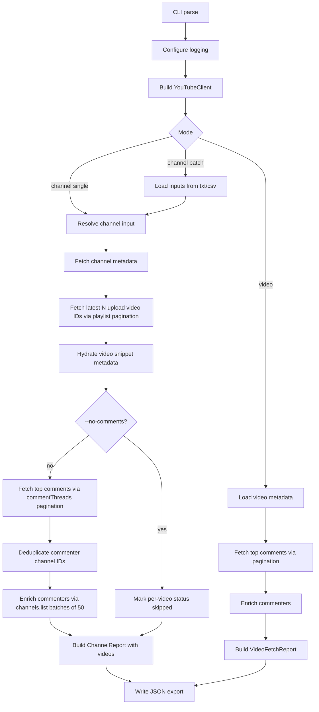

# YouTube Bot Analytics

A JSON-first CLI fetcher for analyzing YouTube channels/videos, extracting comment activity, and enriching commenter channel metadata for bot-pattern review.

## 1) What This Tool Does

This project fetches structured data from YouTube Data API v3 and writes it as JSON for downstream analysis.

Core capabilities:
- Resolve channels from `@handle`, full URL, or canonical `UC...` channel ID.
- Fetch latest **N** videos for a channel (default `10`).
- Fetch top-level comments per video with pagination (default limit `1000`).
- Enrich each commenter with channel metadata (title, custom URL, channel creation timestamp).
- Support single-channel, batch-channel, and single-video workflows.
- Export JSON files to deterministic folder layouts.

## 2) Runtime Requirements

- Python 3.10+
- YouTube Data API key
- Dependencies from `requirements.txt`
- API key file at: `src/credentials/.env`

Example `.env`:

```ini
YOUTUBE_API_KEY=your_api_key_here
# Optional:
# YOUTUBE_REQUEST_DELAY_MS=150
```

## 3) CLI Modes and Commands

Entry point:

```bash
python src/main.py fetch ...
```

### A) Channel Single

Analyze one channel:

```bash
python src/main.py fetch channel single --channel @HombaleFilms
```

Options:
- `--max-videos` (default `10`)
- `--max-comments` (default `1000`)

### B) Channel Batch

Analyze many channels from `.txt` or `.csv`:

```bash
python src/main.py fetch channel batch --batch channels.txt
```

Options:
- `--max-videos` (default `10`)
- `--max-comments` (default `1000`)

### C) Video Mode

Analyze one specific video:

```bash
python src/main.py fetch video --video-id dQw4w9WgXcQ
```

Options:
- `--max-comments` (default `1000`)

### Global Flags

- `--output-dir PATH` Override export base folder (default is `fetch_export/` under project root)
- `--delay-ms N` Delay between API calls
- `--no-comments` Skip comments + commenter enrichment
- `--quiet` Suppress flow logs (errors only) and summary prints
- `--debug` Most detailed logs (higher priority than quiet)
- `-v/--verbose` Explicit alias for default INFO logging

## 4) Logging Behavior and Precedence

Default behavior is **verbose** (INFO-level flow logs).

Precedence:
- `--debug` (highest)
- default INFO (when no `--quiet`)
- `--quiet` (errors only)

Practical meaning:
- Normal run: you see progress across resolve → video fetch → comments pages → enrichment → export.
- Quiet run: only failures/errors.
- Debug run: API timing and lower-level diagnostics.

## 5) End-to-End Flow



## 6) Data Flow by Mode

### Channel Single
1. Resolve channel input to channel ID.
2. Fetch channel snippet/statistics metadata.
3. Fetch latest `max_videos` from uploads playlist (paged).
4. For each video:
   - fetch comments (paged, up to `max_comments`)
   - enrich commenter channels in batches of 50
5. Write **one JSON file** for this channel.

### Channel Batch
1. Parse channel inputs from `.txt` or `.csv`.
2. Run channel flow above per input.
3. Write one JSON file per channel under timestamped batch folder.

### Video
1. Fetch video metadata for `video_id`.
2. Fetch comments (paged up to `max_comments`).
3. Enrich commenters.
4. Write one JSON file for that video.

## 7) Pagination and Enrichment Details

### Video list pagination (channel modes)
- Source: uploads playlist from `channels().list(part="contentDetails")`
- API page size: up to 50
- Stops when either:
  - collected `max_videos`, or
  - no next page

### Comment pagination
- Source: `commentThreads().list(part="snippet")`
- API page size: up to 100 per page
- Stops when either:
  - collected `max_comments`, or
  - no next page/items

### Commenter enrichment
- Extract unique `author_channel_id`s from comments
- Fetch channel snippets in batches of 50
- Map results back into each comment record

## 8) Output Paths (JSON Only)

Default base: `fetch_export/`

- Channel single:
  - `fetch_export/<channel_name>/<timestamp>.json`
- Channel batch:
  - `fetch_export/batch_mode/<timestamp>/<channel_name>.json`
- Video mode:
  - `fetch_export/video_mode/<video_id>/<timestamp>.json`

Path values are sanitized for filesystem safety.

## 9) JSON Schema Walkthrough

## ChannelReport (channel single/batch output)
- `input_raw`: original channel input
- `channel_id`, `title`, `custom_url`, `channel_created_at`
- `subscriber_count`, `video_count`
- `videos`: array of per-video results
- `error`: channel-level fatal error, if any

Each item in `videos`:
- `video`: `{ video_id, title, published_at }`
- `comments_fetched`: total comments returned
- `comments_status`: status for this video’s comment phase
- `comments`: list of enriched comment records
- `error`: per-video error if processing failed

### VideoFetchReport (video mode output)
- `input_video_id`
- `video`: `{ video_id, title, published_at } | null`
- `comments_fetched`, `comments_status`, `comments`
- `error`

### Comment record fields
- `comment_id`, `comment_text`, `comment_published_at`
- `author_display_name`, `author_channel_id`, `like_count`
- `author_channel_title`, `author_channel_created_at`, `author_channel_custom_url`
- `enrichment_status`

## 10) Status Semantics

### `comments_status` (per video/report)
- `ok`: fetched successfully
- `none`: no comments returned
- `disabled`: comments disabled on video
- `skipped`: skipped due to `--no-comments`
- `partial`: some comments fetched before an API error
- `error`: processing failed unexpectedly
- `no_video`: reserved status in model for no-video scenarios

### `enrichment_status` (per comment)
- `ok`: commenter channel metadata found
- `no_channel`: comment had no author channel ID
- `not_found`: author channel ID present but metadata missing
- `pending`: pre-enrichment placeholder (typically not present after full run)

## 11) Log Anatomy (How to Read Verbose Output)

Typical sequence for channel single:
- `Config: ...`
- `Starting channel single fetch: ...`
- `Building channel report for ...`
- `Resolving @handle ...` and `Resolved channel_id=...`
- `Fetching channel metadata ...`
- `Fetching latest N video(s) ...`
- `Fetched uploads page: ...`
- `Hydrating video metadata batch: ...`
- `Processing video <id> (<title>)`
- `Fetching up to X top-level comments ...`
- `Fetched comments page: Y item(s) (total=A/B)`
- `Comments fetch finished ...`
- `Enriching Z unique commenter channel(s)`
- `Enrichment batch size: ...`
- `Commenter enrichment complete ...`
- `Channel report complete ...`
- `Exported ...`

`total=A/B` means:
- `A`: cumulative comments collected so far
- `B`: requested limit (`--max-comments`)

## 12) Batch Input File Format

### `.txt`
- One channel input per line
- Lines starting with `#` ignored

Example:

```text
@HombaleFilms
https://www.youtube.com/@MrBeast
UCX6OQ3DkcsbYNE6H8uQQuVA
```

### `.csv`
- Must include one of these headers:
  - `channel`, `url`, `handle`, `channel_url`, `channel_id`

Example:

```csv
channel
@HombaleFilms
@MrBeast
```

## 13) Common Failure Modes and How They Surface

- Invalid/missing API key:
  - startup fails with configuration error
- Channel resolution failure:
  - channel-level `error` set in JSON
- Video not found (video mode):
  - `error` set on `VideoFetchReport`
- Comments disabled:
  - `comments_status="disabled"`
- Mid-fetch API issue on comments:
  - `comments_status="partial"` if some pages already fetched

## 14) Bot-Analytics Reading Guide

When reviewing exported JSON, prioritize:
- **Very new commenter channels**:
  - compare `author_channel_created_at` vs `comment_published_at`
- **No-channel commenters**:
  - `enrichment_status="no_channel"`
- **Missing commenter metadata**:
  - `enrichment_status="not_found"`
- **Repeated comment text patterns** across many distinct authors
- **Sharp spikes** in low-history commenters on fresh uploads

## 15) Troubleshooting

- If output is too noisy, use `--quiet`.
- If debugging behavior, run with `--debug`.
- If API quota/rate feels tight, increase `--delay-ms`.
- If comments look capped, check `--max-comments` value and whether the video actually has more top-level comments available.

## 16) Developer Notes

High-level layering:
- CLI parse/dispatch
- logic/report orchestration
- service-level API interactions
- exporter pathing/writing

This keeps mode-specific orchestration separate from low-level API calls and serialization.
