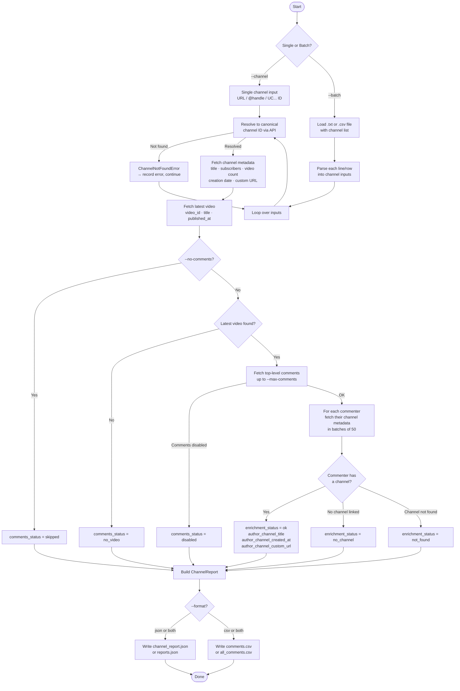
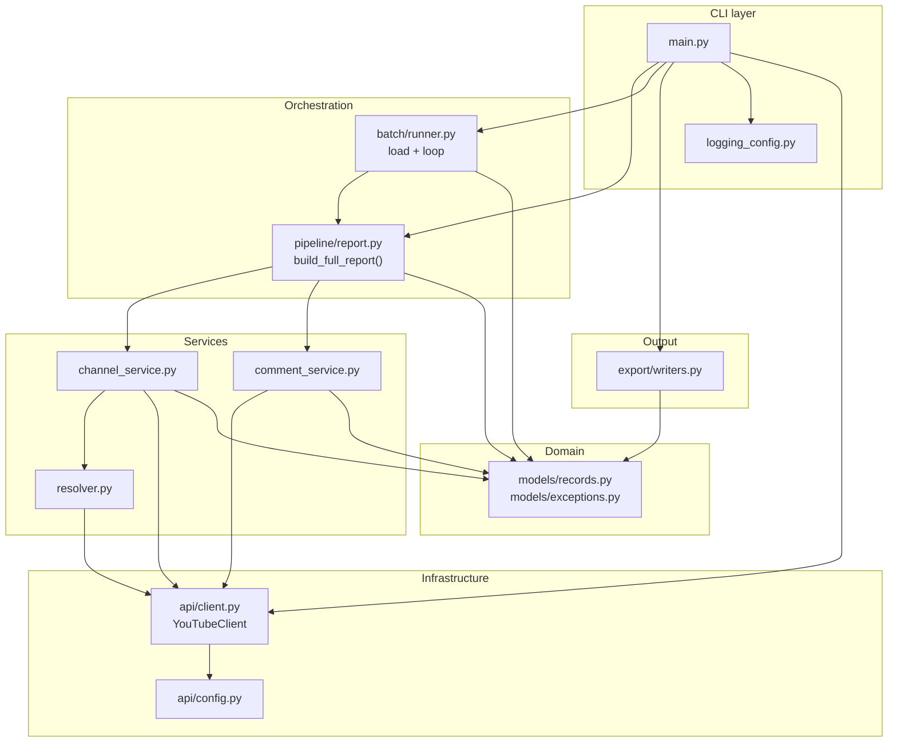
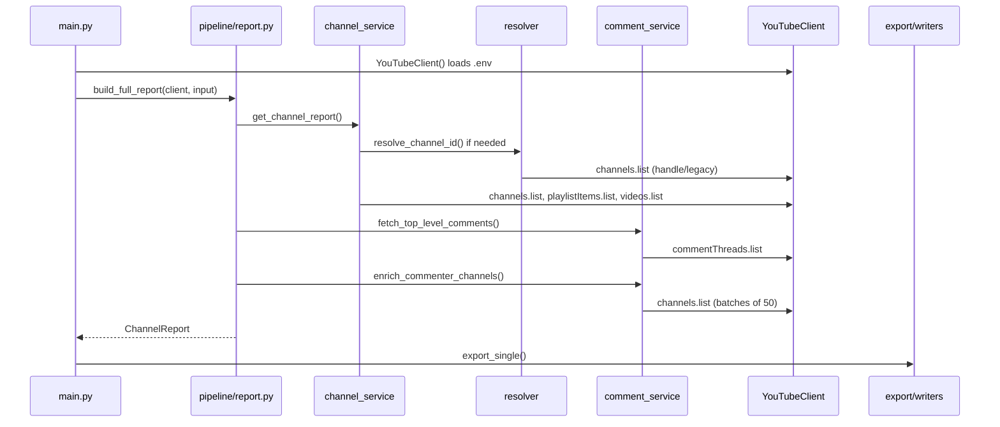
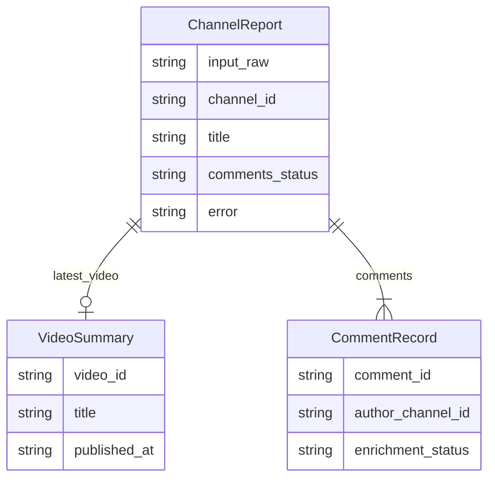

# YouTube Bot Analytics

A CLI tool that fetches YouTube channel metadata, pulls top-level comments from the channel's latest video, and enriches each commenter's profile with their own channel data — so you can spot bot activity by examining account age, missing channel info, or other signals.

## Flowchart



## What it does

1. Resolves any channel input (URL, `@handle`, `UC...` ID) to a canonical channel ID
2. Fetches channel metadata: title, custom URL, creation date, subscriber count, video count
3. Finds the channel's most recently published video
4. Pulls up to N top-level comments from that video
5. For each commenter, fetches their channel metadata (title, creation date, custom URL)
6. Exports the full report to JSON and/or CSV

The commenter enrichment step is the core of bot detection: accounts with no channel, very recent creation dates, or missing metadata are typical signals of bot or spam accounts.

## Setup

**Requirements:** Python 3.10+, a [YouTube Data API v3 key](https://console.cloud.google.com/apis/library/youtube.googleapis.com)

Use the `protoenv` conda environment (or any Python 3.10+ env) from the project root:

```bash
/opt/anaconda3/envs/protoenv/bin/pip install -r requirements.txt
mkdir -p src/credentials
cp src/credentials/.env.example src/credentials/.env
# Edit src/credentials/.env and add your API key
```

### `src/credentials/.env` configuration

```ini
# Required
YOUTUBE_API_KEY=your_key_here

# Delay between API calls in milliseconds (default: 150)
# YOUTUBE_REQUEST_DELAY_MS=150
```

Never commit `src/credentials/.env` or JSON key files — they are listed in `.gitignore`.

## Usage

### Single channel

```bash
/opt/anaconda3/envs/protoenv/bin/python src/main.py --channel @MrBeast
/opt/anaconda3/envs/protoenv/bin/python src/main.py --channel https://www.youtube.com/@MrBeast
/opt/anaconda3/envs/protoenv/bin/python src/main.py --channel UCX6OQ3DkcsbYNE6H8uQQuVA
```

### Batch mode

```bash
/opt/anaconda3/envs/protoenv/bin/python src/main.py --batch channels.txt
/opt/anaconda3/envs/protoenv/bin/python src/main.py --batch channels.csv
```

**channels.txt** — one channel per line, `#` lines are ignored:
```
@MrBeast
https://www.youtube.com/@PewDiePie
UCX6OQ3DkcsbYNE6H8uQQuVA
```

**channels.csv** — must have a column named `channel`, `url`, `handle`, `channel_url`, or `channel_id`:
```csv
channel
@MrBeast
@PewDiePie
```

### Options

| Flag | Default | Description |
|------|---------|-------------|
| `--output-dir PATH` | `output/<timestamp>/` | Exact export directory; default is a new timestamped folder under project `output/` |
| `--format json\|csv\|both` | `both` | Output format |
| `--max-comments N` | `100` | Max top-level comments per video (hard cap: 100) |
| `--no-comments` | off | Skip comment fetching entirely |
| `--delay-ms N` | 150 | Milliseconds between API calls |
| `--quiet` | off | Suppress stdout summary and flow logs (errors only) |
| `-v`, `--verbose` | on (implicit) | Flow logs at INFO (default when not `--quiet`) |
| `--debug` | off | Detailed logs including per-API call timing |

### Logging

By default, the CLI writes **flow logs to stderr** at INFO level so you can follow each step (resolve channel → fetch metadata → comments → export) without mixing them into the stdout summary.

```bash
# Default: INFO flow logs on stderr + summary on stdout
python src/main.py --channel @MrBeast

# Only errors (no flow logs, no summary)
python src/main.py --channel @MrBeast --quiet

# Include API call timing and response counts
python src/main.py --channel @MrBeast --debug
```

## Output files

Each run writes to its own folder so results are not overwritten:

- **Default:** `output/YYYY-MM-DD_HHMMSS/` at the project root (next to `src/`)
- **Custom:** `--output-dir /path/to/my-run` writes directly to that path

Example default layout after a single-channel run:

```
output/
  2026-05-24_153045/
    channel_report.json
    comments.csv
```

The `output/` directory is gitignored.

### Single channel

| File | Contents |
|------|----------|
| `channel_report.json` | Full report: channel metadata, latest video, all enriched comments |
| `comments.csv` | Flat CSV of all comments with commenter channel data |

### Batch

| File | Contents |
|------|----------|
| `reports.json` | Array of full reports, one per channel |
| `all_comments.csv` | All comments across all channels in one flat CSV |

### CSV columns

`target_channel_id`, `target_channel_title`, `video_id`, `video_title`, `comment_id`, `comment_text`, `comment_published_at`, `author_display_name`, `author_channel_id`, `like_count`, `author_channel_title`, `author_channel_created_at`, `author_channel_custom_url`, `enrichment_status`

`enrichment_status` is one of: `ok`, `no_channel`, `not_found`, `pending`

### Status fields (JSON)

| Field | Values | Meaning |
|-------|--------|---------|
| `comments_status` | `ok`, `none`, `disabled`, `skipped`, `no_video` | Whether comments were fetched and why not, if applicable |
| `enrichment_status` (per comment) | `ok`, `no_channel`, `not_found`, `pending` | Whether the commenter's channel metadata was loaded |
| `error` (on report) | string or null | Top-level failure (e.g. channel not found) while still emitting a partial report in batch mode |

## Bot-detection signals (manual review)

This tool does not score or classify bots automatically. Use exported fields to filter in a spreadsheet or downstream script:

- `enrichment_status = no_channel` — comment has no linked YouTube channel (common for throwaway accounts)
- `author_channel_created_at` very recent vs `comment_published_at` — brand-new channel commenting
- Missing `author_channel_title` / `custom_url` with `enrichment_status = not_found` — deleted or hidden channel
- High `like_count` with sparse author metadata — worth a manual look (not proof of bots)

## API quota

Each channel lookup uses roughly:
- 1 unit — resolve channel ID (skipped if input is already `UC...`)
- 1 unit — fetch channel metadata
- 1 unit — latest video via uploads playlist + video snippet
- 1 unit per page — fetch comments (up to 100 comments = 1 `commentThreads.list` call)
- 1 unit per 50 commenters — enrich commenter channels (`channels.list` batch size)

With a daily free quota of 10,000 units, you can comfortably process ~50–100 channels depending on comment volume.

## Architecture

The codebase is a small layered CLI. Dependencies flow **downward only** — upper layers call lower layers, never the reverse.

### Layer diagram



| Layer | Modules | Responsibility |
|-------|---------|----------------|
| **CLI** | `main.py`, `logging_config.py` | Argparse, stderr logging, stdout summary, dispatch single vs batch |
| **Orchestration** | `pipeline/report.py`, `batch/runner.py` | One-channel pipeline; load `.txt`/`.csv` and repeat pipeline per input |
| **Services** | `resolver.py`, `channel_service.py`, `comment_service.py` | YouTube-specific operations (resolve ID, metadata, comments, enrichment) |
| **Infrastructure** | `api/client.py`, `api/config.py` | API client wrapper, `.env` key, delays, quota-related constants |
| **Domain** | `models/records.py`, `models/exceptions.py` | `ChannelReport`, `CommentRecord`, typed status literals, domain errors |
| **Output** | `export/writers.py` | JSON and CSV serialization |

The main extension point is **`build_full_report()`** in `pipeline/report.py` — add new steps there (or new service functions it calls).

### Single-channel request flow



Step-by-step:

1. **`main.main()`** — parse flags, configure logging, create `YouTubeClient` (key from `src/credentials/.env`).
2. **`build_full_report()`** — call `get_channel_report()`; on `ChannelNotFoundError`, return a report with `error` set.
3. **`get_channel_report()`** — `resolve_channel_id()` → `channels.list` → uploads `playlistItems.list` (1 item) → `videos.list` for latest video snippet.
4. **Comments (optional)** — `fetch_top_level_comments()` → `enrich_commenter_channels()` (dedupe author IDs, batch size 50).
5. **`export_single()`** or **`export_batch()`** — write JSON and/or CSV under `output/<timestamp>/` or `--output-dir`.

### Data model



- **`ChannelReport`** — one run per channel input; holds metadata, latest video, comment list, and `comments_status`.
- **`CommentRecord`** — one top-level comment; enrichment fields filled in `comment_service.enrich_commenter_channels()`.
- **`enrichment_status`** — `ok` | `no_channel` | `not_found` | `pending`
- **`comments_status`** — `ok` | `none` | `disabled` | `skipped` | `no_video`

### Channel resolution (`services/resolver.py`)

| Input | Behavior |
|-------|----------|
| `UC` + 22 chars | Use as-is (no API call) |
| `@handle` or bare name | `channels.list(forHandle=...)` |
| `/channel/UC...` | Extract ID from URL |
| `/@handle` | Resolve handle via API |
| `/c/...`, `/user/...` | Legacy paths → `forHandle` or `forUsername` |
| Invalid / not found | `ChannelNotFoundError` → caught in pipeline → `report.error` |

### How YouTube API calls work (read this if `client.service` is confusing)

The project uses Google’s **`google-api-python-client`**. Every call is **two steps**:

```python
# 1. Build a request — no HTTP yet, just describes what you want
request = client.service.channels().list(part="id", forHandle="mrbeast")

# 2. Execute — client.call() runs request.execute() and returns JSON
response = client.call(request, delay_ms=150)
channel_id = response["items"][0]["id"]
```

| Piece | What it is |
|-------|------------|
| `client.service` | The generated YouTube v3 API object (`build("youtube", "v3", ...)`) |
| `.channels()`, `.videos()`, `.commentThreads()` | Resource groups on that object |
| `.list(...)` | Builds one specific HTTP request (still not sent) |
| `client.call(request)` | Runs `.execute()`, logs timing, optional sleep after success |

**Older code used `lambda svc: svc.channels().list(...)`** — that was only a shortcut to pass “how to build the request” into `call()`. It is removed now; build the request on its own line, then pass it to `call()`.

Example from `channel_service.py` (latest video):

```python
playlist_request = client.service.playlistItems().list(
    part="contentDetails",
    playlistId=uploads_playlist_id,
    maxResults=1,
)
playlist_response = client.call(playlist_request, delay_ms=delay_ms)
```

### Rate limiting

`delay_ms` is applied **after** each successful `client.call()`. Set via `--delay-ms` or `YOUTUBE_REQUEST_DELAY_MS` in `.env`.

### Project layout

```
src/
  main.py                 # CLI entry
  logging_config.py       # stderr logging
  api/
    client.py             # YouTubeClient.call()
    config.py             # .env, MAX_COMMENTS_CAP, CHANNELS_BATCH_SIZE
  models/
    records.py            # ChannelReport, CommentRecord, VideoSummary
    exceptions.py         # ChannelNotFoundError, CommentsDisabledError
  services/
    resolver.py           # Input → UC... channel ID
    channel_service.py    # Metadata + latest video
    comment_service.py    # Comments + commenter enrichment
  pipeline/
    report.py             # build_full_report()
  batch/
    runner.py             # load_channel_inputs(), run_batch()
  export/
    output_paths.py       # resolve_output_dir(), timestamped run folders
    writers.py            # export_single(), export_batch()
  credentials/
    .env.example          # YOUTUBE_API_KEY template
```

### Running and imports

`main.py` prepends `src/` to `sys.path`, so imports are `from api import ...` (not `src.api`). Run from the repo root:

```bash
/opt/anaconda3/envs/protoenv/bin/python src/main.py --channel @handle
```

Or set `PYTHONPATH=src`.

### Extending the system

| Goal | Where to change |
|------|-----------------|
| More than latest video | New function in `channel_service.py`, call from `build_full_report()` |
| Reply threads | New service using `comments.list(parentId=...)`; `commentThreads.list` is top-level only |
| Automated bot scoring | Pure function over `list[CommentRecord]` in a new module (no `api/` dependency) |
| New export format | Add writer in `export/writers.py`, wire from `main.py` |
