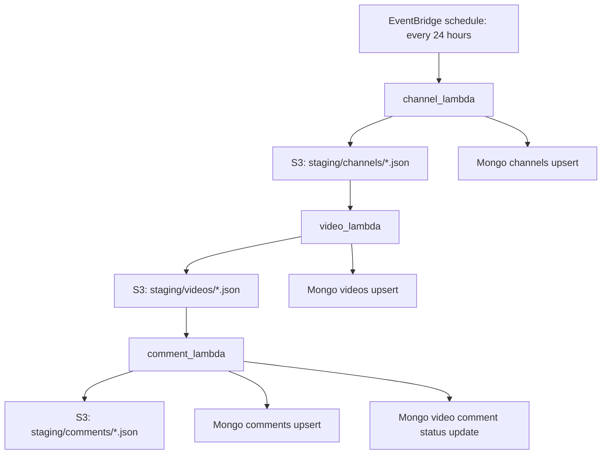

# YouTube Bot Analytics Staged Lambda Pipeline

This branch splits the previous bundled fetch job into three independent AWS
Lambda folders. Each Lambda has a root handler, a task-based `runner.py`, and a
local support package. The runner owns payload formation, YouTube API work, S3
staging writes, and Mongo document shaping.

There is no shared package on purpose. Duplication keeps each Lambda easy to
read and easy to package as a standalone function.

## Runtime Flow



The S3 staging objects are the durable handoff between Lambdas. The pipeline
uses one JSON object per unit of work so S3 triggers can fan out into short,
retryable invocations.

## Folder Map

| Folder | Handler | Trigger | Responsibility |
| --- | --- | --- | --- |
| `channel_lambda/` | `lambda_function.lambda_handler` | EventBridge schedule | `lambda_function.py` calls task functions in `runner.py`; `channel_job/` contains local config, models, S3, Mongo, YouTube, logging, and utility modules. |
| `video_lambda/` | `lambda_function.lambda_handler` | S3 `ObjectCreated` on `staging/channels/` | `lambda_function.py` calls task functions in `runner.py`; `video_job/` contains local config, models, S3, Mongo, YouTube, logging, and utility modules. |
| `comment_lambda/` | `lambda_function.lambda_handler` | S3 `ObjectCreated` on `staging/videos/` | `lambda_function.py` calls task functions in `runner.py`; `comment_job/` contains local config, models, S3, Mongo, YouTube, logging, and utility modules. |

Each local job package contains:

```text
client/
config/
model/
utils/
```

## S3 Prefixes

| Prefix | Written by | Read by | Contents |
| --- | --- | --- | --- |
| `staging/channels/` | `channel_lambda` | `video_lambda` | One resolved channel payload per object. |
| `staging/videos/` | `video_lambda` | `comment_lambda` | One video payload per object. |
| `staging/comments/` | `comment_lambda` | Analytics/debug consumers | Final per-video comment result payload. |

Every staged object includes `created_at` and `expires_at` in the JSON body.
The default logical TTL is two days. Configure the S3 bucket lifecycle with an
expiration rule of `Days=2` for the `staging/` prefix to remove old staging
objects automatically.

## Environment Variables

### `channel_lambda`

| Env name | Required | Default | Description |
| --- | --- | --- | --- |
| `YOUTUBE_API_KEY` | Yes | None | YouTube Data API key. |
| `YOUTUBE_CHANNELS` | No | `CODE_CHANNELS` in `channel_lambda/channel_job/config/settings.py` | Comma-separated channel handles, channel IDs, names, or YouTube channel URLs. When set, this env var is used instead of `CODE_CHANNELS`. |
| `PIPELINE_S3_BUCKET` | Yes | None | Bucket used for channel-stage objects. |
| `CHANNEL_STAGE_PREFIX` | No | `staging/channels` | Prefix for channel-stage objects written by `channel_lambda`. |
| `STAGING_TTL_DAYS` | No | `2` | Logical TTL added to staged payloads and S3 metadata. |
| `YOUTUBE_REQUEST_DELAY_MS` | No | `150` | Delay after each YouTube API call. |
| `LOG_LEVEL` | No | `INFO` | Logging level. Supports standard Python levels such as `DEBUG`, `INFO`, `WARNING`, and `ERROR`. |
| `MONGO_URI` | Yes | None | MongoDB connection string. |
| `MONGO_DB_NAME` | No | `youtube_bot_analytics` | Mongo database name. |
| `MONGO_CHANNELS_COLLECTION` | No | `channels` | Collection for channel documents. |

Leave `CODE_CHANNELS` empty when the channel list should come only from Lambda
environment variables.

### `video_lambda`

| Env name | Required | Default | Description |
| --- | --- | --- | --- |
| `YOUTUBE_API_KEY` | Yes | None | YouTube Data API key. |
| `PIPELINE_S3_BUCKET` | Yes | None | Bucket used to read channel-stage objects and write video-stage objects. |
| `VIDEO_STAGE_PREFIX` | No | `staging/videos` | Prefix for video-stage objects written by `video_lambda`. |
| `STAGING_TTL_DAYS` | No | `2` | Logical TTL added to staged payloads and S3 metadata. |
| `YOUTUBE_MAX_VIDEOS` | No | `20` | Max latest videos fetched per channel. |
| `YOUTUBE_REQUEST_DELAY_MS` | No | `150` | Delay after each YouTube API call. |
| `LOG_LEVEL` | No | `INFO` | Logging level. Supports standard Python levels such as `DEBUG`, `INFO`, `WARNING`, and `ERROR`. |
| `MONGO_URI` | Yes | None | MongoDB connection string. |
| `MONGO_DB_NAME` | No | `youtube_bot_analytics` | Mongo database name. |
| `MONGO_VIDEOS_COLLECTION` | No | `videos` | Collection for video documents. |

### `comment_lambda`

| Env name | Required | Default | Description |
| --- | --- | --- | --- |
| `YOUTUBE_API_KEY` | Yes | None | YouTube Data API key. |
| `PIPELINE_S3_BUCKET` | Yes | None | Bucket used to read video-stage objects and write comment-stage objects. |
| `COMMENT_STAGE_PREFIX` | No | `staging/comments` | Prefix for comment-stage objects written by `comment_lambda`. |
| `STAGING_TTL_DAYS` | No | `2` | Logical TTL added to staged payloads and S3 metadata. |
| `YOUTUBE_MAX_COMMENTS` | No | `2000` | Max top-level comments fetched per video. |
| `YOUTUBE_REQUEST_DELAY_MS` | No | `150` | Delay after each YouTube API call. |
| `LOG_LEVEL` | No | `INFO` | Logging level. Supports standard Python levels such as `DEBUG`, `INFO`, `WARNING`, and `ERROR`. |
| `MONGO_URI` | Yes | None | MongoDB connection string. |
| `MONGO_DB_NAME` | No | `youtube_bot_analytics` | Mongo database name. |
| `MONGO_VIDEOS_COLLECTION` | No | `videos` | Collection for video documents. |
| `MONGO_COMMENTS_COLLECTION` | No | `comments` | Collection for comment documents. |

## Mongo Write Strategy

Writes are idempotent upserts:

| Collection | Upsert key |
| --- | --- |
| Channels | `channel_id` |
| Videos | `video_id` |
| Comments | `comment_id` |

The stage always writes S3 before Mongo. If Mongo fails, the S3 object remains
available for replay/debugging.

Pydantic models define the S3 staging payloads and Mongo document shapes inside
each job package. Lambda code does not create indexes. Create these indexes
manually before production traffic:

```javascript
db.channels.createIndex({ channel_id: 1 }, { unique: true })
db.videos.createIndex({ video_id: 1 }, { unique: true })
db.videos.createIndex({ channel_id: 1, published_at: -1 })
db.comments.createIndex({ comment_id: 1 }, { unique: true })
db.comments.createIndex({ video_id: 1 })
db.comments.createIndex({ channel_id: 1, comment_published_at: -1 })
```

## Packaging

Build one dependency layer from the root requirements:

```bash
mkdir -p python
conda run -n protoenv pip install -r requirements.txt -t python/
zip -r layer.zip python
```

Package each Lambda folder independently:

```bash
cd channel_lambda && zip -r ../channel_lambda.zip .
cd ../video_lambda && zip -r ../video_lambda.zip .
cd ../comment_lambda && zip -r ../comment_lambda.zip .
```

Set each function handler to:

```text
lambda_function.lambda_handler
```

## Local Validation

Use the project Anaconda environment:

```bash
conda run -n protoenv python -m py_compile channel_lambda/*.py video_lambda/*.py comment_lambda/*.py
```

For the full package layout:

```bash
conda run -n protoenv python -m compileall channel_lambda video_lambda comment_lambda
```

This validates syntax without calling AWS, MongoDB, or YouTube.
