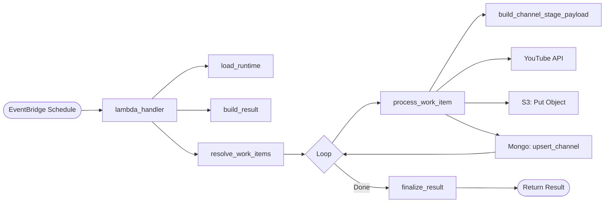
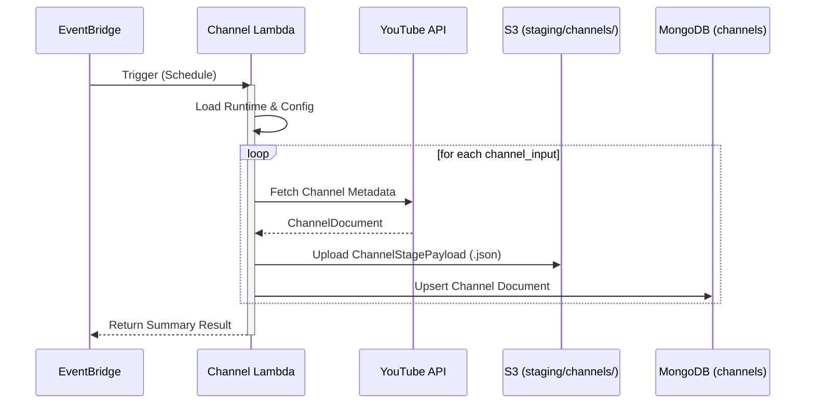
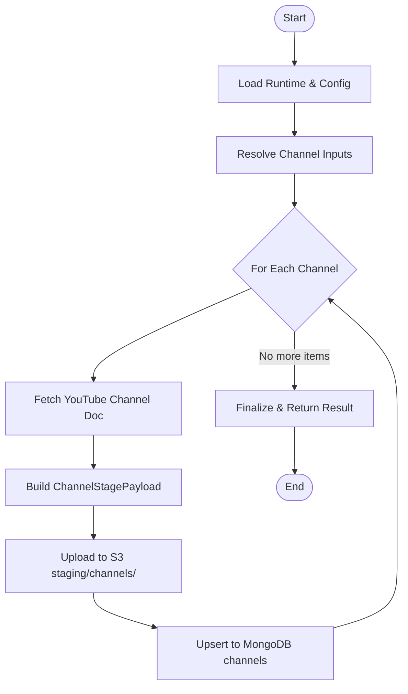

# Channel Lambda

This Lambda function is the entry point of the YouTube Bot Analytics pipeline. It is triggered by an EventBridge schedule (e.g., every 24 hours) to fetch metadata for a configured list of YouTube channels.

### Function Execution Flow

## Responsibility

- Resolves channel identifiers (handles, IDs, names, or URLs) into unique YouTube channel IDs.
- Fetches detailed channel metadata from the YouTube Data API.
- Upserts channel metadata into MongoDB.
- Stages a JSON payload for each channel in S3 to trigger the `video_lambda`.

## Trigger

- **EventBridge Schedule**: Typically runs once a day.
- **Manual/Test**: Can be invoked with an empty event or a job override.

## Runtime Flow

1. **Load Runtime**: Initializes settings, YouTube client, S3 client, and MongoDB writer.
2. **Resolve Work Items**: Normalizes the list of channels from the `YOUTUBE_CHANNELS` environment variable or the local settings file.
3. **Process Each Channel**:
    - Fetches the channel document from YouTube.
    - Builds a `ChannelStagePayload`.
    - Uploads the payload to S3 at `s3://<bucket>/<prefix>/<channel_id>-<job_id>.json`.
    - Upserts the channel document into the MongoDB `channels` collection.
4. **Finalize**: Returns a summary of the run, including counts of staged items and any errors encountered.

## Environment Variables

| Env name | Required | Default | Description |
| --- | --- | --- | --- |
| `YOUTUBE_API_KEY` | Yes | None | YouTube Data API key. |
| `YOUTUBE_CHANNELS` | No | `CODE_CHANNELS` | Comma-separated channel handles, IDs, names, or URLs. |
| `PIPELINE_S3_BUCKET` | Yes | None | Bucket used for channel-stage objects. |
| `CHANNEL_STAGE_PREFIX` | No | `staging/channels` | Prefix for channel-stage objects. |
| `STAGING_TTL_DAYS` | No | `2` | Logical TTL added to staged payloads and S3 metadata. |
| `YOUTUBE_REQUEST_DELAY_MS` | No | `150` | Delay after each YouTube API call. |
| `LOG_LEVEL` | No | `INFO` | Logging level (`DEBUG`, `INFO`, etc.). |
| `MONGO_URI` | Yes | None | MongoDB connection string. |
| `MONGO_DB_NAME` | No | `youtube_bot_analytics` | Mongo database name. |
| `MONGO_CHANNELS_COLLECTION` | No | `channels` | Collection for channel documents. |

## Data Models

The Lambda uses Pydantic models for validation and serialization:
- `ChannelDocument`: The shape of the document stored in MongoDB.
- `ChannelStagePayload`: The shape of the JSON object written to S3.

## Error Handling

Errors during the processing of a specific channel are caught and logged, allowing the Lambda to continue processing other channels in the list. The final response will contain an `errors` list if any items failed.
