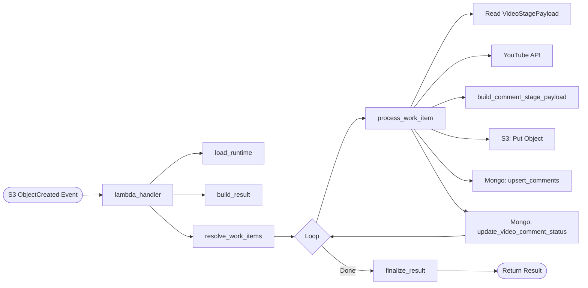
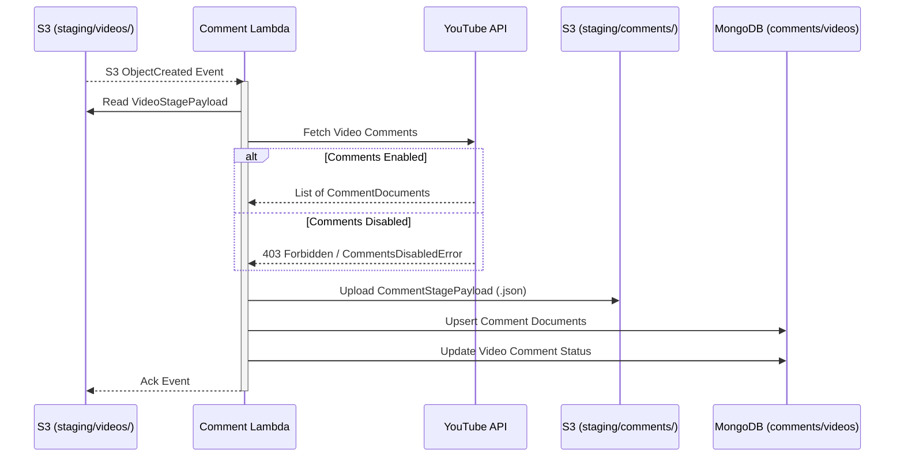
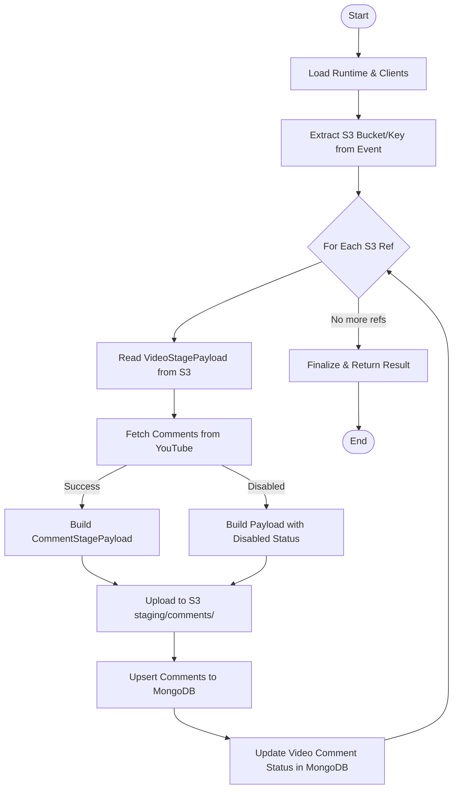

# Comment Lambda

This Lambda function processes video metadata staged in S3 and fetches top-level comments for each video.

### Function Execution Flow

## Responsibility

- Triggered by S3 `ObjectCreated` events in the `staging/videos/` prefix.
- Fetches top-level comments (up to `YOUTUBE_MAX_COMMENTS`) for the video using the YouTube Data API.
- Enriches comments with author channel metadata (title, custom URL, creation date) where available.
- Upserts comment metadata into MongoDB with `enrichment_status`.
- Updates the parent video document in MongoDB with comment status (e.g., `ok`, `disabled`, `none`).
- Stages a final JSON result payload for each video in S3.

## Trigger

- **S3 ObjectCreated**: Responds to new JSON files in `s3://<bucket>/staging/videos/`.

## Runtime Flow

1. **Load Runtime**: Initializes settings and clients.
2. **Resolve Work Items**: Extracts the bucket and key from the S3 event.
3. **Process Video Stage Object**:
    - Reads the `VideoStagePayload` from S3.
    - Fetches comments for the `video_id` from YouTube.
    - Handles cases where comments are disabled.
    - Builds a `CommentStagePayload` containing all fetched comments and status.
    - Uploads the payload to S3 at `s3://<bucket>/<prefix>/<video_id>-<job_id>.json`.
    - Upserts all fetched comment documents into the MongoDB `comments` collection.
    - Updates the video document in the MongoDB `videos` collection with `comments_status`, `comments_fetched`, and any error messages.
4. **Finalize**: Returns a summary including comment counts and MongoDB update counts.

## Environment Variables

| Env name | Required | Default | Description |
| --- | --- | --- | --- |
| `YOUTUBE_API_KEY` | Yes | None | YouTube Data API key. |
| `PIPELINE_S3_BUCKET` | Yes | None | Bucket used to read video stages and write comment stages. |
| `COMMENT_STAGE_PREFIX` | No | `staging/comments` | Prefix for comment-stage objects. |
| `STAGING_TTL_DAYS` | No | `2` | Logical TTL added to staged payloads and S3 metadata. |
| `YOUTUBE_MAX_COMMENTS` | No | `2000` | Max top-level comments fetched per video. |
| `YOUTUBE_REQUEST_DELAY_MS` | No | `150` | Delay after each YouTube API call. |
| `LOG_LEVEL` | No | `INFO` | Logging level (`DEBUG`, `INFO`, etc.). |
| `MONGO_URI` | Yes | None | MongoDB connection string. |
| `MONGO_DB_NAME` | No | `youtube_bot_analytics` | Mongo database name. |
| `MONGO_VIDEOS_COLLECTION` | No | `videos` | Collection for video documents (to update status). |
| `MONGO_COMMENTS_COLLECTION` | No | `comments` | Collection for comment documents. |

## Data Models

The Lambda uses Pydantic models for validation and serialization:
- `VideoStagePayload`: The input schema read from S3.
- `CommentDocument`: The shape of the document stored in MongoDB, including author enrichment fields. Note that fields ending in `_at` are automatically enriched with a `__d` suffix containing a native BSON datetime when written to MongoDB.
- `CommentStagePayload`: The final output schema written to S3.

## Error Handling

Special handling is included for `CommentsDisabledError`, which is a common occurrence on YouTube. Instead of failing, the Lambda records the `disabled` status and continues. Other unexpected errors are logged and included in the result.
