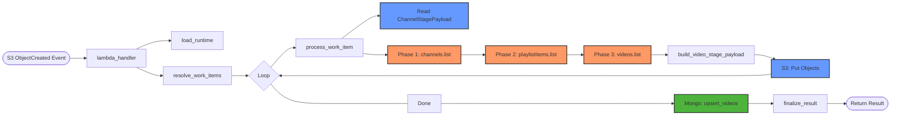
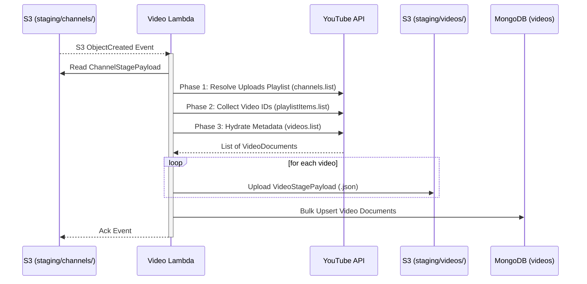

# Video Lambda

This Lambda function processes channel metadata staged in S3 and fetches the latest videos for each channel.

### Function Execution Flow



### Legend
| Icon/Color | Client | Description |
| :--- | :--- | :--- |
| 🟠 | **YouTube** | Data retrieval via YouTube Data API |
| 🔵 | **S3** | Staging payload read/write |
| 🟢 | **MongoDB** | Batch video metadata persistence |

## Responsibility

- Triggered by S3 `ObjectCreated` events in the `staging/channels/` prefix.
- Fetches the latest videos (up to `YOUTUBE_MAX_VIDEOS`) for the channel using the YouTube Data API.
- Upserts video metadata into MongoDB.
- Stages a JSON payload for each discovered video in S3 to trigger the `comment_lambda`.

## Trigger

- **S3 ObjectCreated**: Responds to new JSON files in `s3://<bucket>/staging/channels/`.

## Runtime Flow



```mermaid
flowchart TD
    Start([Start]) --> LoadRuntime[Load Runtime & Clients]
    LoadRuntime --> ResolveRefs[Extract S3 Bucket/Key from Event]
    ResolveRefs --> ForEachRef{For Each S3 Ref}
    
    ForEachRef --> ReadS3[Read ChannelStagePayload from S3]:::s3
    ReadS3 --> P1[Phase 1: Resolve 'Uploads' Playlist via channels.list]:::youtube
    P1 --> P2[Phase 2: Collect Video IDs via playlistItems.list]:::youtube
    P2 --> P3[Phase 3: Hydrate Metadata via videos.list]:::youtube
    P3 --> ForEachVideo{For Each Video}
    
    ForEachVideo --> BuildPayload[Build VideoStagePayload]
    BuildPayload --> UploadS3[Upload to S3 staging/videos/]:::s3
    UploadS3 --> ForEachVideo
    
    ForEachVideo ---- Done ----> UpsertMongo[Bulk Upsert Videos to MongoDB]:::mongodb
    UpsertMongo --> ForEachRef
    
    %% Termination path
    ForEachRef ---- No more refs ----> Finalize[Finalize & Return Result]
    Finalize --> End([End])

    classDef youtube fill:#f96,stroke:#333,stroke-width:2px;
    classDef s3 fill:#69f,stroke:#333,stroke-width:2px;
    classDef mongodb fill:#4db33d,stroke:#333,stroke-width:2px;
```

1. **Load Runtime**: Initializes settings and clients.
2. **Resolve Work Items**: Extracts the bucket and key from the S3 event.
3. **Process Channel Stage Object**:
    - **Read Payload**: Reads the `ChannelStagePayload` from S3.
    - **Three-Phase Discovery**:
        - **Phase 1 (Playlist Resolution)**: Finds the channel's "Uploads" playlist ID using `channels().list(part="contentDetails", id=...)`.
        - **Phase 2 (ID Collection)**: Retrieves the latest video IDs from that playlist using `playlistItems().list(playlistId=..., maxResults=...)`.
        - **Phase 3 (Snippet Hydration)**: Performs a batch call to fetch full metadata for all discovered video IDs using `videos().list(part="snippet", id="...")`.
    - **Stage Early (Inside Loop)**: For each video discovered:
        - Builds a `VideoStagePayload` (includes both channel and video metadata).
        - Uploads the payload to S3 at `s3://<bucket>/<prefix>/<video_id>-<job_id>.json`. This triggers downstream processing immediately.
    - **Persist Late (After Loop)**: Performs a single **bulk upsert** of all fetched video documents into the MongoDB `videos` collection.
4. **Finalize**: Returns a summary including the number of videos staged and MongoDB upsert counts.

## Environment Variables

| Env name | Required | Default | Description |
| --- | --- | --- | --- |
| `YOUTUBE_API_KEY` | Yes | None | YouTube Data API key. |
| `PIPELINE_S3_BUCKET` | Yes | None | Bucket used to read channel stages and write video stages. |
| `VIDEO_STAGE_PREFIX` | No | `staging/videos` | Prefix for video-stage objects. |
| `STAGING_TTL_DAYS` | No | `2` | Logical TTL added to staged payloads and S3 metadata. |
| `YOUTUBE_MAX_VIDEOS` | No | `20` | Max latest videos fetched per channel. |
| `YOUTUBE_REQUEST_DELAY_MS` | No | `150` | Delay after each YouTube API call. |
| `LOG_LEVEL` | No | `INFO` | Logging level (`DEBUG`, `INFO`, etc.). |
| `MONGO_URI` | Yes | None | MongoDB connection string. |
| `MONGO_DB_NAME` | No | `youtube_bot_analytics` | Mongo database name. |
| `MONGO_VIDEOS_COLLECTION` | No | `videos` | Collection for video documents. |

## Data Models

The Lambda uses Pydantic models for validation and serialization:
- `ChannelStagePayload`: The input schema read from S3.
- `VideoDocument`: The shape of the document stored in MongoDB. Note that fields ending in `_at` are automatically enriched with a `__d` suffix containing a native BSON datetime when written to MongoDB.
- `VideoStagePayload`: The output schema written to S3.

## Error Handling

If a channel stage object fails to process, the error is logged and included in the result. Since it's triggered by S3, individual failures can be retried by the Lambda service depending on the event source configuration.
